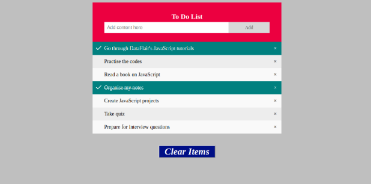

# Web_Dev_try

A trial based project for learning Web Programming. ToDo list is quite essential in both personal and professional life, so in order to test the skills it can be considered as the best option.

## Working

The project is a single webpage containing different list items and a text area to add custom tasks. The “Add” button lets the user add an object to the list. We have the facility to check the items from the list or remove them if we want. If we wish, we can clear all the list items with a single button. It is a very user-friendly and user-interactive project that makes the work of a user a lot easier.

- The first step of our JavaScript project is adding HTML. The HTML file will contain all the elements we need to show on our page when it loads. The project also includes the location of our CSS and JavaScript files that we will create in the further sections. The following is the content of your HTML file. You can edit these elements as you like and get the result in the browser.
- The next step is adding CSS in the webpage. To do that, create a new file in the text editor, copy the code below in the file, then save it with the name ‘toDo.css’ or 'style.css'. You can vary the file location of the file, but remember, it is standard procedure to save the CSS and JavaScript files in separate folders to avoid confusion.
- The styling of the webpage is perfect. It is time to change the page from static to dynamic. We will achieve this task with the help of JavaScript. First of all, let’s create a JavaScript file ‘toDo.js’or 'script.js' and save the following code in the file.

#### output of our todo list
In this tutorial, we successfully built a todo list app that allows a user to add new tasks, mark a task as completed and delete old ones. This is a basic example of a todo list which can be built after understanding the concepts of HTML, CSS and JS. It would be great to keep working on it along with making some transitions.

## Dependencies

- Python 3.6
- HTML5
- CSS3
- JavaScript
- PHP(Xampp)

## 📦 Install
Any code editor can be used according to developers choice.
- Visual Studio Code
- Sublime Test editor
- Atom
- CodePen(online platform)
- Google Colab
